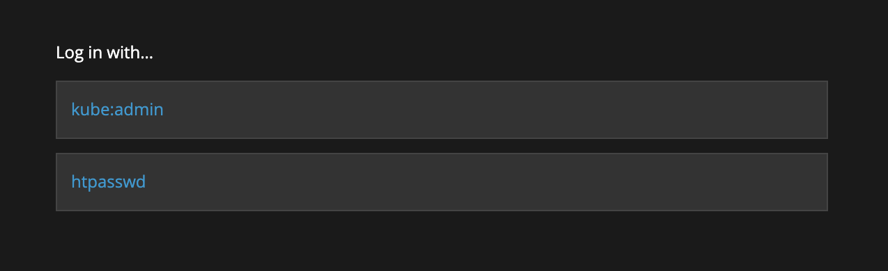
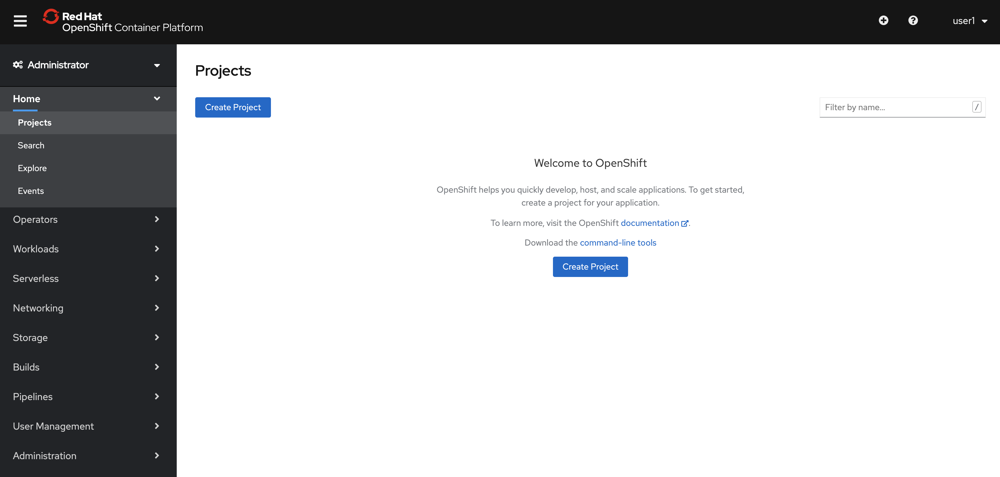
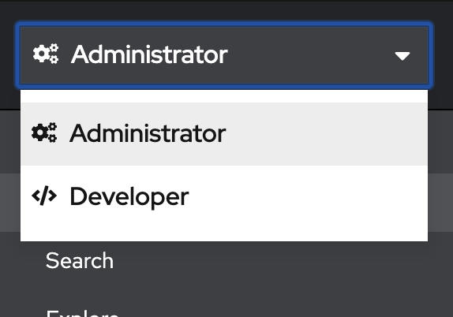
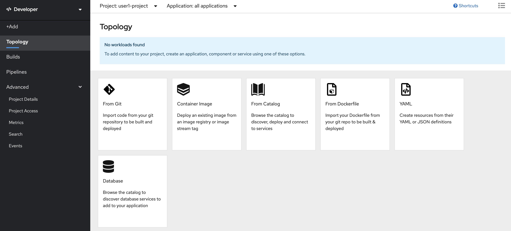

= Explore OpenShift Developer Console

== Prerequisites
* You have access to OpenShift Web Console URL. Ask your workshop coordinator for URL if you don't have one.
* You have credentials to log in. Ask your workshop coordinator for credentials to log onto the OpenShift cluster.

== Introduction

OpenShift 4.x provides a Developer Web Console for anyone trying to deploy and manage applications to the cluster. This GUI is different from Administration Console that is typically used by cluster administrators. Developer Web Console employed by application developers and deployers, application operations, or anyone with an application focus.

== Explore

* Paste the Web Console URL in the browser.  We recommend using Chrome. It will ask you to log in.

* Select `htpasswd` and login with your credentials, i.e., `username` and `password` assigned to you. 

**NOTE**  Most likely, your workshop environment has a user authentication setup using `htpasswd`. OpenShift integrates with a variety of authentication providers. Your workshop set up to authenticate using other mechanisms such as GitHub or other forms of authentication. If you don’t see 'htpasswd`, ask your workshop coordinator.

* Once you log in, you’ll see a page similar to what shown below. Notice your `username` on the right top corner. Also, notice the menu bar on the left.

* Select _Create Project_ button item to create a new project. Name the project based on your `username` `USER?-project` by substituting `USER?`` with the `username` assigned to you. Project names are unique in a multi-user cluster.

* You can now toggle to Developer view by pressing on the `Administrator` dropdown and selecting `Developer`. In this lab we will focus on Developer view.

* You will now see the developer console. This console has a Menu on the left, and the main area shows different ways to deploy workloads in this project.

* Take your time and explore menu options.
** **Topology** shows the applications deployed. Since we haven’t deployed anything yet, it just shows different ways to deploy workloads in this project.
** **Builds** shows the OpenShift build configurations. Once a build configuration created, you can execute, view, and edit build configuration and view build logs.
** **Pipelines** take you to the OpenShift pipeline. You can view, edit, and run tekton pipelines. Also, review the related pipeline resources, tasks, and logs.
** **Advanced** Section includes a bunch of subsections.
*** **Project Details** shows the project’s status, inventory of all the objects deployed in this project, utilization of CPU, memory, resource quotas, and events.
*** **Project Access** allows you to add members and change their permissions.
*** **Metrics** allow you to query project metrics.
*** **Search** allows you to search for all the artifacts in this project.
*** **Events** show a stream of project events.

## Review 
In this lab, we logged into the cluster using Web Console and understood the layout and navigation of Developer console which is typically used by the application teams (developers, deployers, and builders)

=== Next Deploy an Application

* <<2.DeployAppUsingWebConsole.adoc#, Deploy an application using Developer Console>>

