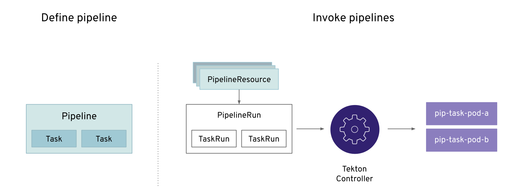
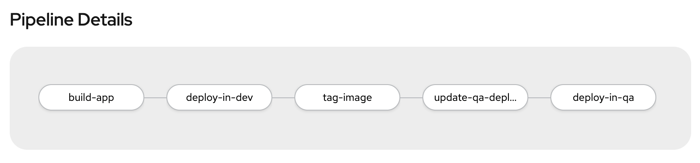
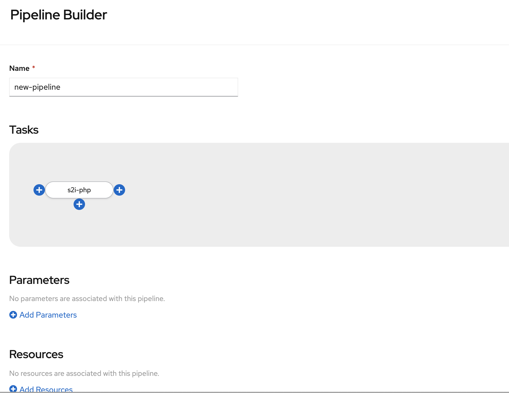
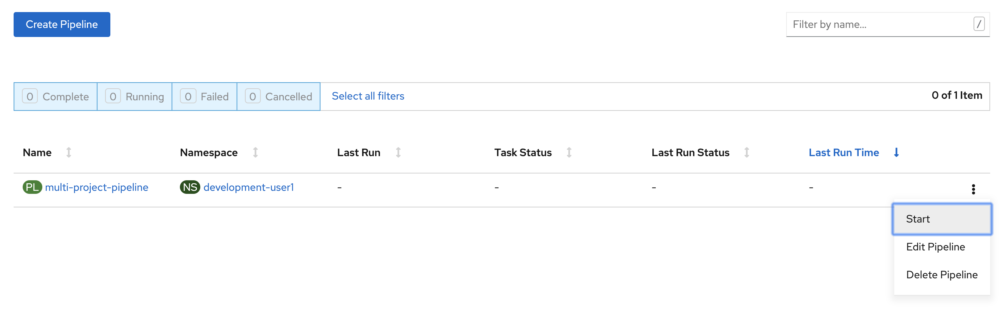
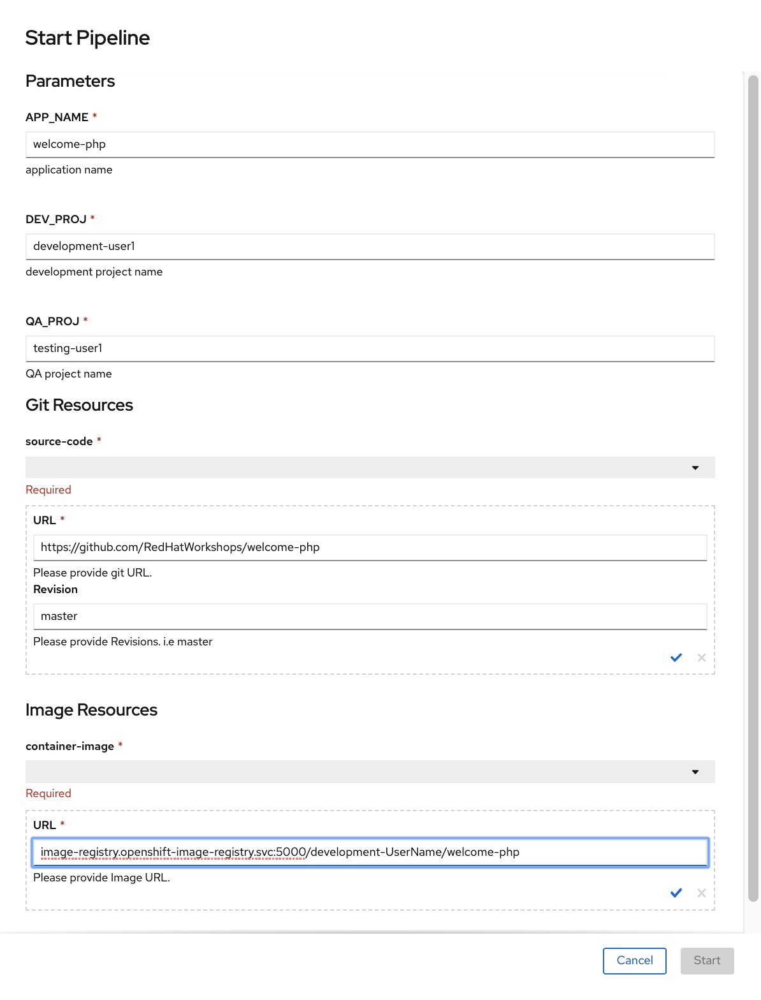
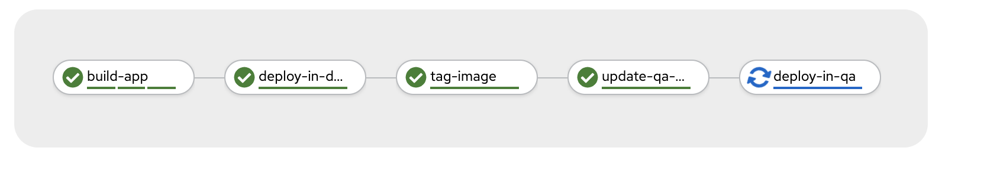
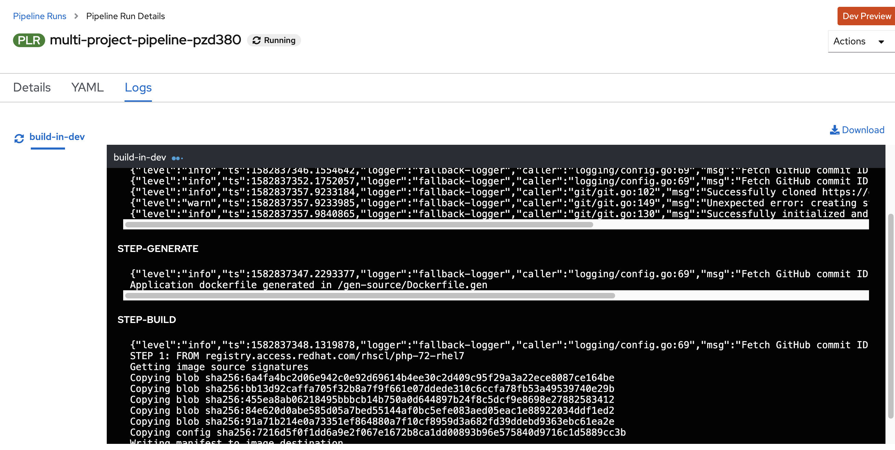

= Build, Deploy and Promote application across projects with Tekton Pipelines 

== Introduction

In this lab we will learn to write a Tekton pipeline to build, deploy and promote an application across environments. As an example we will use development and QA environments as promotion to pre-prod and production will be very similar.

Tekton is an open source project that is supported as OpenShift Pipelines on an OpenShift 4.x cluster.

Tekton defines a number of https://kubernetes.io/docs/concepts/extend-kubernetes/api-extension/custom-resources[Kubernetes custom resources] as building blocks in order to standardize pipeline concepts and provide a terminology that is consistent across CI/CD solutions. These custom resources are an extension of the Kubernetes API that let users create and interact with these objects using `kubectl` and other Kubernetes tools.

The custom resources needed to define a pipeline are listed below:

* `Task`: a reusable, loosely coupled number of steps that perform a specific task (e.g. building a container image)
* `Pipeline`: the definition of the pipeline and the `Tasks` that it should perform
* `PipelineResource`: inputs (e.g. git repository) and outputs (e.g. image registry) to and out of a pipeline or task
* `TaskRun`: the execution and result of running an instance of task
* `PipelineRun`: the execution and result of running an instance of pipeline, which includes a number of `TaskRuns`

In short, in order to create a pipeline, one does the following:

* Create custom or install https://github.com/tektoncd/catalog[existing] reusable `Tasks`
* Create a `Pipeline` and `PipelineResources` to define your application's delivery pipeline
* Create a `PipelineRun` to instantiate and invoke the pipeline

For further details on pipeline concepts, refer to the https://github.com/tektoncd/pipeline/tree/master/docs#learn-more[Tekton documentation] that provides an excellent guide for understanding various parameters and attributes available for defining pipelines.

== Prerequisites
We will continue with an example that we used in the lab <<17.CodePromotion.adoc#,Code promotion across environments>>. So if you haven't done that lab, please complete that lab and come back here. 

== Create a Tekton Pipeline

* We have created two projects with names for Development and QA in the previous lab. Switch the context to development project

CAUTION:  Substitute UserName with your value below
----
$ oc project development-UserName
----

* OpenShift Pipelines is installed and managed by an operator. This operator also installs a bunch of cluster level tasks. Let us look at the cluster tasks by running

----
$ tkn clustertasks list
NAME                       AGE
buildah                    1 day ago
buildah-v0-10-0            1 day ago
jib-maven                  1 day ago
kn                         1 day ago
maven                      1 day ago
openshift-client           1 day ago
...
...
...
----

We will use a couple of tasks from this list to build a pipeline.

* The pipeline will do the exact same steps that we discussed in the previous lab

* Build the application using S2I in the development project
* Deploy the application in the development project
* Tag the successful image as `promote-qa`
* Deploy the application in the testing project

This pipeline can be built either using CLI or with Developer Console using Pipelines menu item.

Let us look at the pipeline code that accomplishes the above:

----
apiVersion: tekton.dev/v1alpha1
kind: Pipeline
metadata:
  name: multi-project-pipeline
spec:
  params:
    - default: php-app
      description: application name
      name: APP_NAME
      type: string
    - default: development
      description: development project name
      name: DEV_PROJ
      type: string
    - default: testing
      description: QA  project name
      name: QA_PROJ
      type: string
  resources:
    - name: source-code
      type: git
    - name: container-image
      type: image
  tasks:
    - name: build-in-dev
      params:
        - name: MINOR_VERSION
          value: '2'
        - name: PATH_CONTEXT
          value: .
        - name: TLSVERIFY
          value: 'false'
      resources:
        inputs:
          - name: source
            resource: source-code
        outputs:
          - name: image
            resource: container-image
      taskRef:
        kind: ClusterTask
        name: s2i-php
    - name: deploy-in-dev
      params:
        - name: ARGS
          value:
            - rollout
            - latest
            - dc/$(params.APP_NAME)
      runAfter:
        - build-in-dev
      taskRef:
        kind: ClusterTask
        name: openshift-client
    - name: tag-image
      params:
        - name: ARGS
          value:
            - tag
            - '$(params.DEV_PROJ)/$(params.APP_NAME):latest'
            - '$(params.DEV_PROJ)/$(params.APP_NAME):promote-qa'
      runAfter:
        - deploy-in-dev
      taskRef:
        kind: ClusterTask
        name: openshift-client
    - name: deploy-in-qa
      params:
        - name: ARGS
          value:
            - rollout
            - latest
            - dc/$(params.APP_NAME)
            - '-n'
            - $(params.QA_PROJ)
      runAfter:
        - tag-image
      taskRef:
        kind: ClusterTask
        name: openshift-client

----

* `taskRef` are pointing to `ClusterTask`
*  Using `s2i-php` to build the app from source code and generate container image. Look at the `inputs` and `outputs` for this task . These are supplied as `resources` when we start the pipeline
* `openshift-client` task or `oc` is used to rollout changes to developmet project and to testing project. It is also used for `oc tag` the image when it is ready for QA
* Parameters `APP_NAME`, `DEV_PROJ` and `QA_PROJ` are used to supply your own values or application name, development project and qa project respectively while running the pipeline
* `runAfter` allows you to sequence the tasks per your needs

The above https://raw.githubusercontent.com/RedHatWorkshops/openshiftv4-devday/master/tekton-pipeline.yaml[pipeline] is provided to you so that you can create it directly using CLI.

* Create pipeline running the following command

----
$ oc create -f https://raw.githubusercontent.com/RedHatWorkshops/openshiftv4-devday/master/tekton-pipeline.yaml
----

Run `tkn pipelines list` to verify

----
% tkn pipeline list
NAME                     AGE             LAST RUN                        STARTED          DURATION    STATUS
multi-project-pipeline   2 minutes ago   multi-project-pipeline-hbff55   12 minutes ago   2 minutes   Succeeded
----

You can also check the pipeline to be available using Developer Console using Pipelines Menu item

== Set Permissions to allow pipeline service account to deploy across projects

The following command will allow `pipeline` service account in development project to be able to deploy app in the QA project.

CAUTION:  Substitute UserName with your value below

----
$ oc adm policy add-role-to-user admin system:serviceaccount:development-UserName:pipeline -n testing-UserName
----

== Running Pipeline

You can run the pipeline from devconsole directly. This allows you to add pipeline resources before running the pipeline. You can also fill in the values for parameters.

Fill the parameters and resource values. You will have to press on  to create resources. Start the pipeline by pressing on Start button

CAUTION:  Substitute UserName with your value below

**Resources**

* `source-code` value `https://github.com/RedHatWorkshops/welcome-php` and `Revision` as `master`
* `container-image` value `image-registry.openshift-image-registry.svc:5000/development-UserName/welcome-php:latest`

**Parameters**

* `APP_NAME` value `welcome-php`
* `DEV_PROJ` value `development-UserName`
* `QA_PROJ` value `testing-UserName`

You can verify that the corresponding resources are created on command line by running

----
$ tkn resources list
NAME           TYPE    DETAILS
git-gboh0a     git     url: https://github.com/RedHatWorkshops/welcome-php
image-9ehc45   image   url: image-registry.openshift-image-registry.svc:5000/development-UserName/welcome-php
----

and the running pipeline

----
$ tkn pipelinerun list
NAME                            STARTED          DURATION   STATUS             
multi-project-pipeline-77eisq   23 seconds ago   ---        Running
----

Developer Console also shows the running pipeline

NOTE: A running pipeline is an instance of pipeline and is called **pipelinerun** and a running task is called a **taskrun**

Click on the a taskrun to view its logs

As the pipeline gets to deploy steps you will note the application gets redeployed. You can notice the pod getting redeployed on the developer console.

