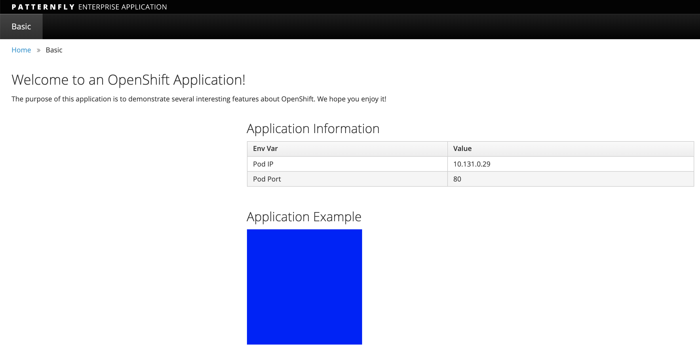
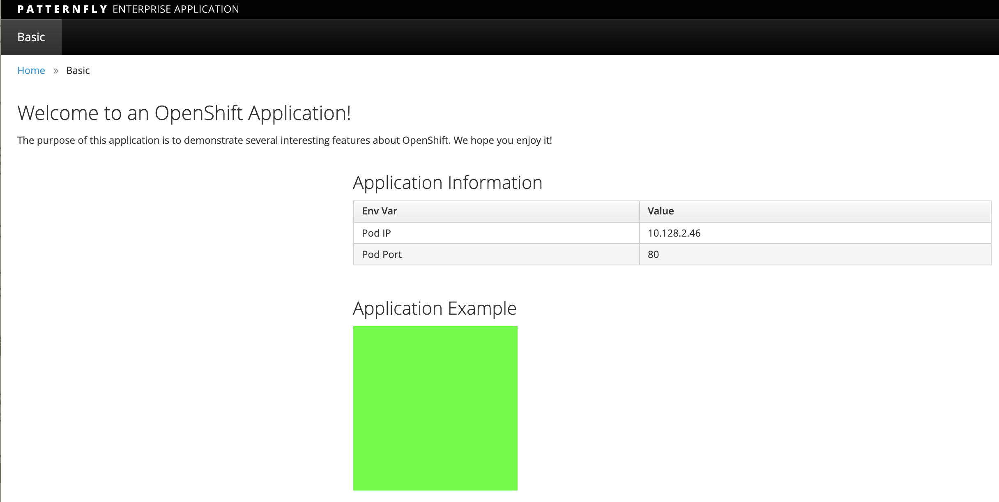

= Blue-Green Deployments

== Introduction

In this lab we will learn doing BlueGreen Deployments with OpenShift.

So what is Bluegreen?

Blue-green deployment is a release strategy that can be utilized by
developers for deploying software in a production environment. Blue can
be one particular production environment whereas green can define an
identical production environment. Under blue-green deployment strategy,
software developers are able to minimize downtime and reduce risk.
https://en.wikipedia.org/wiki/User:Nuqing/Blue-green_deployment[1*]

In this Lab, we will be:

* Deploying two versions of the same application. The first version will
display a blue rectangle.
* Create an OpenShift route (a FQDN) that can be used to expose the applications.
* We will first expose the version 1, the blue version.
* We will also create another version of this application in the same
project that displays a green rectangle.
* We will then switch OpenShift route from the first application (blue) to
the second application (green).

== Create a new project

*Remember* to substitute the username

....
$ oc new-project bluegreen-UserName --display-name="Blue Green Project" --description="Blue Green Project"
....

== Deploy Blue Version and Test

List existing image builder or image streams
....
$ oc new-app -S --image-stream=php

Image streams (oc new-app --image-stream=<image-stream> [--code=<source>])                                  
-----                                                                                                       
php                                                                                                         
  Project: openshift                                                                                        
  Tags:    7.0, 7.1, 7.2, latest
....

We will be using a sample php application that displays a blue or green
rectangle. The sample app can be browsed at
https://github.com/RedHatWorkshops/bluegreen

We have two branches `blue` and `green` . Version 1 uses `blue` branch and version 2 uses `green` branch.

....
$ oc new-app --image-stream=php --code=https://github.com/RedHatWorkshops/bluegreen#blue  --name=blue
....

Monitor the application build

....
$ oc get builds

NAME      TYPE      FROM          STATUS     STARTED              DURATION
blue-1    Source    Git@afdc492   Complete   About a minute ago   1m8s
....

Using the build name of the recently created application run:

....
$ oc logs build/blue-1
....

Once the build finishes you should see something similar to:

....
...
Pushing image image-registry.openshift-image-registry.svc:5000/bluegreen-user1/blue:latest ...              
Getting image source signatures                                                                             
Copying blob sha256:450cddac446d5cb2b7ab48687d2b43e9207fda7364bbfe320a757793d0ed9607                        
Copying blob sha256:4fbc3bafa3d4400bb97a733c1fe12f2f99bf38b9d5b913d5034f29798739654d                        
Copying blob sha256:1cd26fbb2b2181a18c41ece85dff8b293e399e50dc3abe227b1940450bf6298b                        
Copying blob sha256:34971b2d1eb98e410c2802e6bb3a7f499f9c5bff1b870ed329089ecdb21cf856                        
Copying blob sha256:0453406be68523ccc82999f84fffc57af64e00d9be0b75169c642c952b9bf7bc                        
Copying blob sha256:707235ac60367dff674607b0be2e18a83daea6dc2c8fb7330dbf7de29baf094b                        
Copying config sha256:59c852379e346ff3e3a28ca8210d6c6a3fb65f5cdab621eaf4b1c8ba2c6ddc96                      
Writing manifest to image destination                                                                       
Storing signatures                                                                                          
Successfully pushed image-registry.openshift-image-registry.svc:5000/bluegreen-user1/blue@sha256:b870a5ea982
9f678c305deadb6dec69dbeb1e22fcf87498cc8ab49d2c36f82a4                                                       
Push successful                             
....

Once build is successful, you will see running pods.

....
$ oc get pods                                                                          
NAME            READY   STATUS      RESTARTS   AGE                                                          
blue-1-build    0/1     Completed   0          2m35s                                                        
blue-1-deploy   0/1     Completed   0          25s                                                          
blue-1-rgrdm    1/1     Running     0          17s
....

Notice that the build pod has exited and you now have a single instance
of the application running under one single pod.

List the service

....
$ oc get service
....

**Note: ** While we are exposing the `blue` service, we are actually naming the route as `bluegreen` as we are going to do bluegreen deployments with the same route instance.

....
$ oc expose service blue --name=bluegreen
....

Look at the route that got created now

It should look something like this

....
$ oc get route                                                                         
NAME        HOST/PORT                                              PATH   SERVICES   PORT       TERMINATION 
  WILDCARD                                                                                                  
bluegreen   bluegreen-bluegreen-user1.apps.first.40.ocpcloud.com          blue       8080-tcp               
  None 
....

Now test the application by copying your Route URL in the browser. You should see something similar to:

At this point you have deployed an application that displays for
illustration purposes a blue rectangle for version 1.

== Deploy Green Version

* Deploy a new version of this application (Same one as before with a
very small change)

* Point the previously created FQDN (route) to the new service that will
be created as part of the new application creation process.

Let us deploy new green version of the application in the same way we did blue version. Make sure to name the application as `green' this time.

....
$ oc new-app --image-stream=php --code=https://github.com/RedHatWorkshops/bluegreen#green --name=green
....

* Wait until the application is built and deployed. You should now see
two services if you run:

....
$ oc get svc                                                                           
NAME    TYPE        CLUSTER-IP       EXTERNAL-IP   PORT(S)             AGE                                  
blue    ClusterIP   172.30.240.196   <none>        8080/TCP,8443/TCP   15m                                  
green   ClusterIP   172.30.128.91    <none>        8080/TCP,8443/TCP   12s 
....

== Switching from Blue to Green

Check the route again and note that it is still pointing to `blue` service. 

....
$ oc get routes                                                                        
NAME        HOST/PORT                                              PATH   SERVICES   PORT       TERMINATION 
  WILDCARD                                                                                                  
bluegreen   bluegreen-bluegreen-user1.apps.first.40.ocpcloud.com          blue       8080-tcp               
  None   

  $ oc set route-backends bluegreen                                                      
NAME              KIND     TO    WEIGHT                                                                     
routes/bluegreen  Service  blue  100 
....

The command `oc set route-backends` will show how the traffic is flowing from the route to the backend service.

Now let us change the route to send all the traffic to green by running 

....
$ oc set route-backends bluegreen green=100

route.route.openshift.io/bluegreen backends updated
....

So by doing this we updated the route named `bluegreen` to send all the traffic to green service backend.

You can confirm the change is made in two ways

....
$ oc set route-backends bluegreen                                                      
NAME              KIND     TO     WEIGHT                                                                    
routes/bluegreen  Service  green  100 

$ oc get route bluegreen                                                               
NAME        HOST/PORT                                              PATH   SERVICES   PORT       TERMINATION 
  WILDCARD                                                                                                  
bluegreen   bluegreen-bluegreen-user1.apps.first.40.ocpcloud.com          green      8080-tcp               
  None  
....

Let us test the application by using th same route in the browser

You should now see the new version of the recently deployed application with a green rectangle as below.

== Clean up

* Delete application

....
oc delete all --all
....

* Delete the project; **substituting** the username in the command below
....
oc delete project bluegreen-UserName
....

== Summary

* Blue-Green deployments can be easily accomplished on OpenShift.
* We have shown multiple versions of an application; all running concurrently, each with a unique service.
* All that is needed to expose any of the applications is to change the
service being used by the route to publicly advertise the application.
* You can split traffic across two services