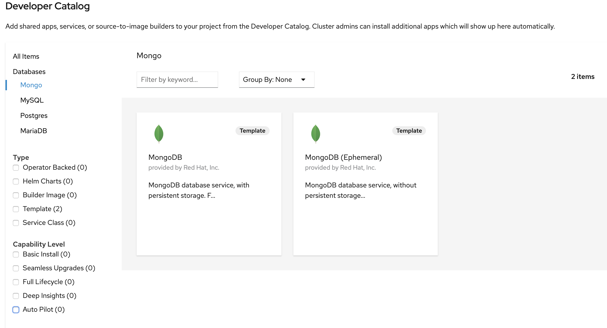
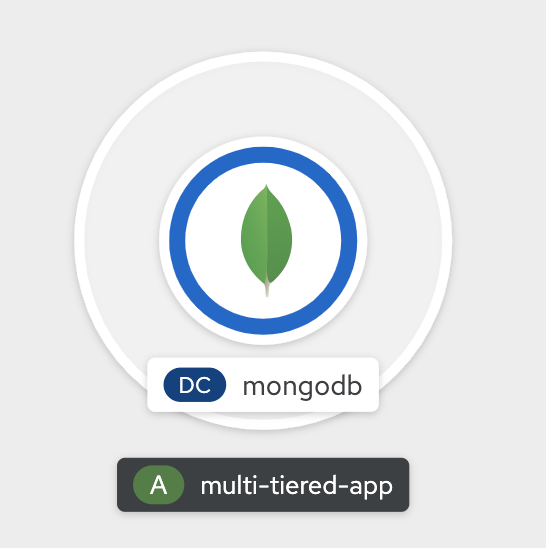
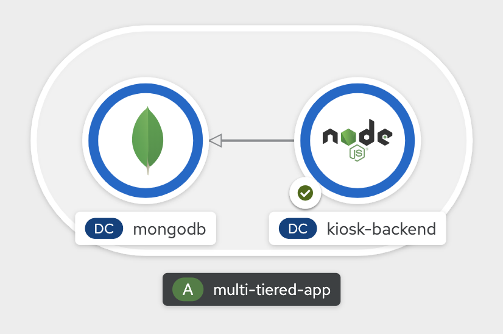
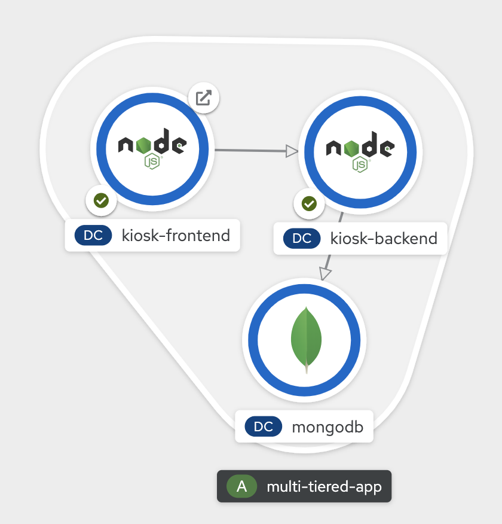
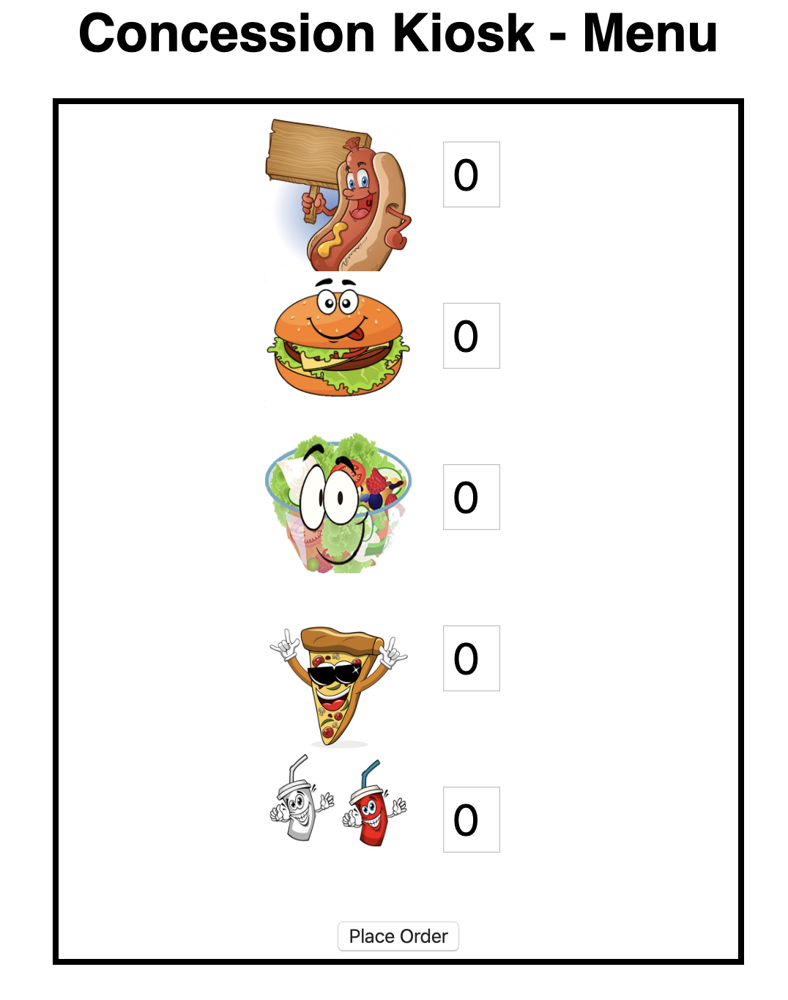
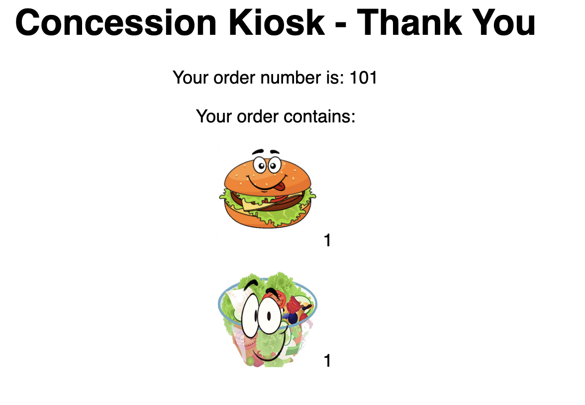

ifdef::env-github[]
:tip-caption: :bulb:
:note-caption: :information_source:
:important-caption: :heavy_exclamation_mark:
:caution-caption: :fire:
:warning-caption: :warning:
endif::[]

= Deploy Multi-tiered Application

== Introduction
In this lab we will learn to deploy a multi-tiered application on OpenShift. This will be a typical three tier application with database, backend component and a frontend component.

== Deploy a Database

Create a new project 

CAUTION:  Substitute UserName with your value below

....
oc new-project multitier-UserName
....

We will use MongoDB. You can deploy MongoDB using command line as follows:

----
oc new-app mongodb-ephemeral \
-l app.openshift.io/runtime=mongodb,\
app.kubernetes.io/part-of=multi-tiered-app
----

* `app.openshift.io/runtime=mongodb` is a label to display runtime icon on webconsole

* `app.kubernetes.io/part-of=multi-tiered-app` displays the deployment as part of an application grouping called `multi-tiered-app` on web console

Or you can also use WebConsole and select `Mongodb Ephemeral` from the developer catalog

This will deploy the database and also create a secret that has credentials to connect to the database. Note the name of that secret as we will be using that with our backend application to connect to the database.

----

..
..
..
--> Creating resources with label app.kubernetes.io/part-of=multi-tiered-app,app.openshift.io/runtime=mongodb ...
    secret "mongodb" created # <1>
    service "mongodb" created # <2>
    deploymentconfig.apps.openshift.io "mongodb" created # <3>
--> Success
    Application is not exposed. You can expose services to the outside world by executing one or more of the commands below:
     'oc expose svc/mongodb' 
    Run 'oc status' to view your app.
----
<1> this is the database secret that we will inject into our backend app later
<2> this is the database service
<3> this is the deploymentconfig

Once deployed, you have the first tier of the 3-tier app deployed that shows up on the web console as

== Deploy Backend Application

Now we will deploy the backend application by running the following commands. The first command deploys the application and the second one applies an annotation to visually show connection to the database on the web console. 

[NOTE]
You can deploy this from web console by browsing through the the catalog and supplying the source code URL as input and selecting the runtime.

....

oc new-app https://github.com/RedHatWorkshops/openshiftv4-odo-workshop-backend.git \
--name=kiosk-backend \
-l app.openshift.io/runtime=nodejs,\
app.kubernetes.io/part-of=multi-tiered-app

oc annotate dc/kiosk-backend app.openshift.io/connects-to=mongodb
....

* `app.openshift.io/runtime=nodejs` is a runtime label to display icon on web console
* `app.kubernetes.io/part-of=multi-tiered-app` is a label to make app part-of application group
* `app.openshift.io/connects-to=mongodb` is an annotation to display connectivity between backend and database

This will start openshift S2I build for your backend application. The build will run  for a few mins. 

....
..
..
--> Creating resources with label app.kubernetes.io/part-of=multi-tiered-app,app.openshift.io/runtime=nodejs ...
    imagestream.image.openshift.io "kiosk-backend" created
    buildconfig.build.openshift.io "kiosk-backend" created
    deploymentconfig.apps.openshift.io "kiosk-backend" created
    service "kiosk-backend" created
--> Success
    Build scheduled, use 'oc logs -f bc/kiosk-backend' to track its progress.
    Application is not exposed. You can expose services to the outside world by executing one or more of the commands below:
     'oc expose svc/kiosk-backend' 
    Run 'oc status' to view your app.
....

You can watch build logs either using web console or via command line `oc logs build/kiosk-backend-1`

In the meanwhile, we will patch the deployment configuration to add environment variables that reference the database secret. This is required for your backend application to make a service connection to the database.

....
oc patch dc/kiosk-backend --type='json' -p='[{"op": "add", "path": "/spec/template/spec/containers/0/env", "value": [ { "name": "username", "valueFrom": {  "secretKeyRef": { "name": "mongodb", "key": "database-user" }  } },{ "name": "password", "valueFrom": {  "secretKeyRef": { "name": "mongodb", "key": "database-password" }  } },{ "name": "database_name", "valueFrom": {  "secretKeyRef": { "name": "mongodb", "key": "database-name" }  } },{ "name": "admin_password", "valueFrom": {  "secretKeyRef": { "name": "mongodb", "key": "database-admin-password" }  } } ] }]'
....

Applying this patch will add the following to the deployment configuration. You can check the deployment configuration by running `oc get dc/kiosk-backend -o yaml`.

----
    spec:
      containers:
      - env:
        - name: username
          valueFrom:
            secretKeyRef:
              key: database-user
              name: mongodb
        - name: password
          valueFrom:
            secretKeyRef:
              key: database-password
              name: mongodb
        - name: database_name
          valueFrom:
            secretKeyRef:
              key: database-name
              name: mongodb
        - name: admin_password
          valueFrom:
            secretKeyRef:
              key: database-admin-password
              name: mongodb

----

This configuration creates the secret mappings and assigns respective values from the secrets to the environment variables when the container starts running. 

[cols=2*, options=header]
|===
|env variable
|key from secret

|username
|database-user

|password
|database-password

|database_name
|database-name

|admin_password
|database-admin-password
|===

Once deployed, you have the 1st and 2nd tiers of the 3-tier app deployed that shows up on the web console as

== Deploy Frontend

Let us now deploy the frontend component. While creating the frontend we will also link this to the backend component that we deployed in the last step by passing the environment variables that point to the backend service.

[NOTE]
You can deploy this from web console by browsing through the the catalog and supplying the source code URL as input and selecting the runtime.

....

oc new-app https://github.com/RedHatWorkshops/openshiftv4-odo-workshop.git \
--name=kiosk-frontend \
-l app.openshift.io/runtime=nodejs,\
app.kubernetes.io/part-of=multi-tiered-app \
-e COMPONENT_BACKEND_HOST=$(oc get svc kiosk-backend --template={{.spec.clusterIP}}) \
-e COMPONENT_BACKEND_PORT=$(oc get svc kiosk-backend  -o=jsonpath='{ .spec.ports[?(@.name == "8080-tcp")].targetPort }')

oc annotate dc/kiosk-frontend app.openshift.io/connects-to=kiosk-backend
....

* `COMPONENT_BACKEND_HOST` is an env variable that points to backend service
* `COMPONENT_BACKEND_PORT` is an env variable that points to backend service port
* `app.openshift.io/connects-to=kiosk-backend` is an annotation to show connection from frontend component to backend on the web console

NOTE: `oc get svc kiosk-backend --template={{.spec.clusterIP}}` provides service name and 
`oc get svc kiosk-backend  -o=jsonpath='{ .spec.ports[?(@.name == "8080-tcp")].targetPort }'` gives you the service port. You can find these values by running `oc get svc kiosk-backend` directly and substitute those values. The above line shows how you can script it all into one line. 

Create a route to expose your frontend component via openshift router.

....
oc expose svc kiosk-frontend
....

[NOTE] 
We did not expose our backend application to create an openshift route. This is because it would be accessed only within the openshift cluster. So, you would only want to expose those services that need to be accessed from outside the cluster.

Once done, you have all 3 tiers of your app deployed that shows up on the web console as

== Test App
Now test the application by accessing its URL. You can get the URL by running 

....
oc get route kiosk-frontend --template={{.spec.host}}
....

Test in the browser, you will see this screen.Place and order and confirm that you are getting an order number with order details:

[.float-group]
--
[.left]
 

[.right]

--

== Clean up
Run these commands to clean up your multi-tiered application. 

* Delete frontend component:

----
oc delete all -l app=kiosk-frontend
----

* Delete backend component
----
oc delete all -l app=kiosk-backend 
----

* Delete  database component
----
oc delete all -l app=mongodb-ephemeral
----

* Delete database secret
----
oc delete secret mongodb
----

* Delete project/namespace

CAUTION: Substitute UserName before running the command

----
oc delete project multitiered-UserName
----

