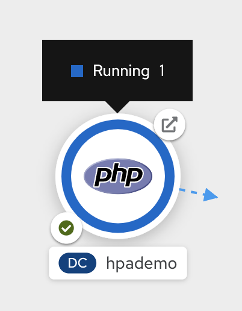
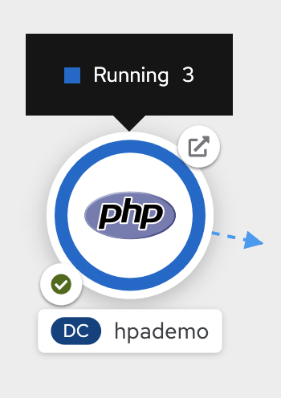
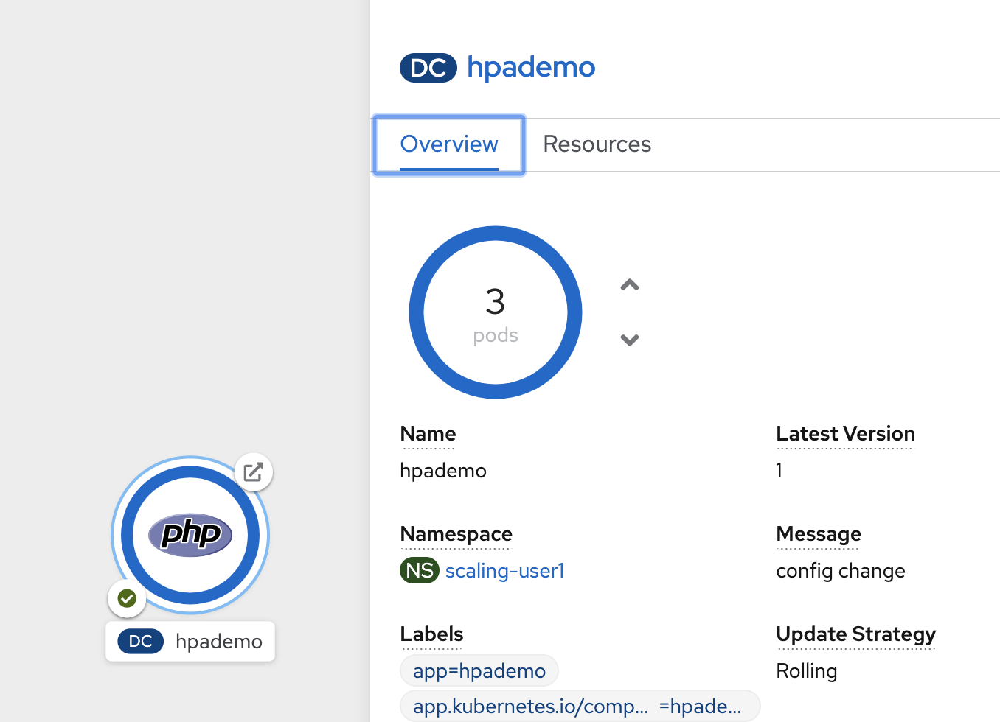
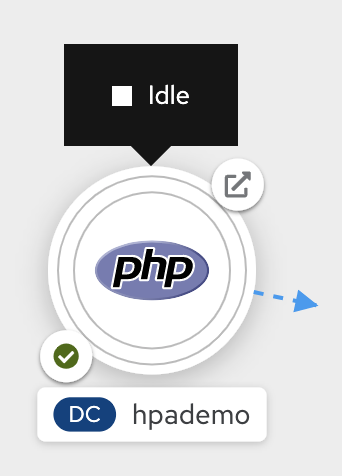
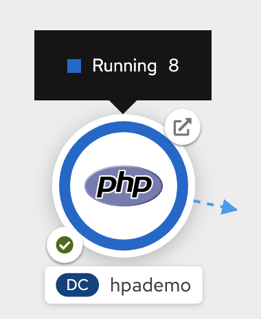

= Scale up and Scale down and Idle the application 

== Introduction
In this exercise we will learn how to scale our application. OpenShift has the capability to scale your application based on the workload.

First we will deploy an application, scale it up and down manually. We will also learn **Idling** which is a unique concept in OpenShift. 

Then we will learn to setup horizontal pod autocaler that automatically scales your application based on the workload and scales down when the workload reduces.


== Deploy an Application to Scale
=== Create a new Project

Replace **UserName** with yours before creating the project.

=== Deploy an application*

We will deploy a simple PHP application that has `index.php` which does some computation. You can deploy using web console or CLI. Steps below show the deployment using CLI by running `oc new-app --image-stream=php --code=https://github.com/RedHatWorkshops/hpademo` as shown below


```
oc new-app --image-stream=php --code=https://github.com/RedHatWorkshops/hpademo                                                             
--> Found image 9dbe5f9 (13 days old) in image stream "openshift/php" under tag "7.2" for "php"                                                                    
                                                                                                                                                                   
    Apache 2.4 with PHP 7.2                                                                                                                                        
    -----------------------                                                                                                                                        
    PHP 7.2 available as container is a base platform for building and running various PHP 7.2 applications and frameworks. PHP is an HTML-embedded scripting langu
age. PHP attempts to make it easy for developers to write dynamically generated web pages. PHP also offers built-in database integration for several commercial and
 non-commercial database management systems, so writing a database-enabled webpage with PHP is fairly simple. The most common use of PHP coding is probably as a re
placement for CGI scripts.                                                                                                                                         
                                                                                                                                                                   
    Tags: builder, php, php72, rh-php72                                                                                                                            
                                                                                                                                                                   
    * The source repository appears to match: php                                                                                                                  
    * A source build using source code from https://github.com/RedHatWorkshops/hpademo will be created                                                             
      * The resulting image will be pushed to image stream tag "hpademo:latest"                                                                                    
      * Use 'oc start-build' to trigger a new build                                                                                                                
    * This image will be deployed in deployment config "hpademo"                                                                                                   
    * Ports 8080/tcp, 8443/tcp will be load balanced by service "hpademo"                                                                                          
      * Other containers can access this service through the hostname "hpademo"                                                                                    
                                                                                                                                                                   
--> Creating resources ...                                                                                                                                         
    imagestream.image.openshift.io "hpademo" created                                                                                                               
    buildconfig.build.openshift.io "hpademo" created                                                                                                               
    deploymentconfig.apps.openshift.io "hpademo" created                                                                                                           
    service "hpademo" created                                                                                                                                      
--> Success                                                                                                                                                        
    Build scheduled, use 'oc logs -f bc/hpademo' to track its progress.                                                                                            
    Application is not exposed. You can expose services to the outside world by executing one or more of the commands below:                                       
     'oc expose svc/hpademo'                                                                                                                                       
    Run 'oc status' to view your app.
```

This will start an S2I build for the php application. You can run `oc get builds` and also watch the logs by running `oc logs -f hpademo-1-build`. You know drill by now!!

Create a route by exposing the service

```
$ oc expose svc hpademo
route.route.openshift.io/hpademo exposed

```
Run `oc get route` to get the URL for your application. Eventually your application gets built and deployed.

If you curl the URL you will see that the `index.php` page does some computation and displays `OK!`

```
curl $(oc get route hpademo --template={{.spec.host}})                                                                                      
OK!
```

== Scaling

=== Understanding Replicas Setting in Deployment Configuration vs Replication Controller

Check the deployment configuration for this application by running `oc get dc/hpademo` and focus on `spec`

```
spec:                                                                                                                                                              
  replicas: 1  
```

You'll notice that the `replicas:` is set to `1`. This tells OpenShift that when this application deploys, make sure that there is 1 instance running. The `replicationController` mirrors this configuration initially; the `replicationController` (or `rc`) will ensure that there is always the
set number of instances always running.

To view the `rc` for your application first get the current pod running.

....
$ oc get pods                                                                                                                                 
NAME               READY   STATUS      RESTARTS   AGE                                                                                                              
hpademo-1-build    0/1     Completed   0          9m7s                                                                                                             
hpademo-1-deploy   0/1     Completed   0          6m56s                                                                                                            
hpademo-1-zl2ht    1/1     Running     0          6m47s 
....

This shows that the . Let us view the `rc` on this build.

....
$ oc get rc/hpademo-1                                                                                                                         
NAME        DESIRED   CURRENT   READY   AGE                                                                                                                        
hpademo-1   1         1         1       14m 
....

*Note:* You can change the number of replicas in `DeploymentConfig` or the `ReplicationController`.

However note that if you change the `deploymentConfig` it applies to your application. This means, even if you delete the current replication
controller, the new one that gets created will be assigned the REPLICAS value based on what is set for DC. If you change it on the Replication Controller, the application will scale up. But if you happen to delete the current replication controller for some reason, you will loose that setting.

=== Manual Scaling

To scale your application we will edit the `deploymentConfig` to 3.

Open your browser to the Topology page and note you only have one instance running. It shows when you hover over the deployment.



Now scale your application using the `oc scale` command (remembering to specify the `dc`)

```
$ oc scale --replicas=3 dc/hpademo                                                                                                            
deploymentconfig.apps.openshift.io/hpademo scaled
```

If you look at the web console and you will see that there are 3 instances running now



*Note:* You can also scale up and down from the web console by navigating to overview page and clicking twice on up arrow right next to the pod count circle to change replica count.



On the command line, see how many pods you are running now:

....
$ oc get pods                                                                                                                                  
NAME               READY   STATUS      RESTARTS   AGE                                                                                                              
hpademo-1-2cz8m    1/1     Running     0          8m24s                                                                                                            
hpademo-1-7tcz6    1/1     Running     0          8m24s                                                                                                            
hpademo-1-build    0/1     Completed   0          29m                                                                                                              
hpademo-1-deploy   0/1     Completed   0          27m                                                                                                              
hpademo-1-zl2ht    1/1     Running     0          27m 
....

You now have 3 instances of `hpademo-1` running (each with a different pod-id). If you check the `rc` of the `hpademo-1` build you will see that it has been updated by the `dc`.

....
$ oc get rc/hpademo-1                                                                                                                         
NAME        DESIRED   CURRENT   READY   AGE                                                                                                                        
hpademo-1   3         3         3       28m 
....

== Idling

A related concept is application idling. OpenShift allows you to conserve resources by sleeping the application when not in use. When you try to use the application it will spin up the container automagically.

== Idling the application

Run the following command to find the available endpoints

....
$ oc get endpoints                                                                                                                            
NAME      ENDPOINTS                                                        AGE                                                                                     
hpademo   10.128.2.37:8443,10.129.2.29:8443,10.130.2.28:8443 + 3 more...   37m 
....

Note that the name of the endpoints is `hpademo` and there are three ip addresses for the three pods.

Run the `oc idle endpoints/hpademo` command to idle the application

....
$ oc idle endpoints/hpademo                                                                                                                   
The service "scaling-user1/hpademo" has been marked as idled                                                                                                       
The service will unidle DeploymentConfig "scaling-user1/hpademo" to 3 replicas once it receives traffic                                                            
DeploymentConfig "scaling-user1/hpademo" has been idled  
....

Go back to the web console. You will notice that the pods show up as idled.



At this point the application is idled, the pods are not running and no resources are being used by the application. This doesn’t mean that the application is deleted. The current state is just saved.. that’s all.

=== Reactivate your application

Now click on the application route URL or access the application via curl.

Note that it takes a little while for the application to respond. This is because pods are spinning up again. You can notice that in the web console.

In a little while the output comes up and your application would be up with 3 pods (based on your replica count).

So, as soon as the user accesses the application, it comes up!!!

=== Scaling Down

Scaling down is the same procedure as scaling up. Use the `oc scale`
command on the `hpademo` application `dc` setting.

```
$ oc scale --replicas=1 dc/hpademo

deploymentconfig.apps.openshift.io/hpademo scaled 
```

Alternately, you can go to project overview page and click on down arrow twice to remove 2 running pods.

== Auto Scaling

Horizontal Pod AutoScaler (HPA) allows you to automatically scale your application based on the workload. It updates `replicacount` by watching the workload. 

=== Set Resource Limits on your application

HPA requires your pods to have requests and limits set so that it knows when to scale the application based on the consumption of resources.

Let us update the deployment to set the resources by running `oc set resources`

```
$ oc set resources dc hpademo --requests=cpu=200m --limits=cpu=500m                                                                           
deploymentconfig.apps.openshift.io/hpademo resource requirements updated 
```

We have set the CPU request (initial allocation) as `200` millicores and limit (maximum allocation) to `500` millicores. So when we ask HPA to scale based on percentage workload, it measures based on these numbers.

=== Set up HPA

Now we will create HPA by running `oc autoscale` command

```
$ oc autoscale dc hpademo --cpu-percent=50 --min=1 --max=10                                                                                   
horizontalpodautoscaler.autoscaling/hpademo autoscaled
```
Here we are did two things:

* `cpu-percent=50` indicates that when the CPU usage (based on requests and limits) reaches 50%, HPA should spin up additional pods
* `--min=1 --max=10` sets upper and lower limits for the number of pods. We want to run minimum 1 pod and maximum it can scale up to 10 pods. Why? We cannot allow our application to consume all resources on the cluster.. right?

=== Generate Load

Now it is time to generate load and test

Open another terminal and login to the cluster. Make sure you are in the same project. And run the load generator pod from that terminal.

```
$ oc run --generator=run-pod/v1 -it --rm load-generator --image=busybox /bin/sh
If you don't see a command prompt, try pressing enter.
~ $ 

```

This spins up a `busybox` image from where we will generate the load. 

Get the URL for your application `oc get route hpademo --template={{.spec.host}}`, and use that in the following command inside the load generator at the prompt

`while true; do wget -q -O- URL; done`

You will start seeking a bunch of `OK!` s as the load generator continuously hits the application.

=== Watch Scaling

In the other terminal, run `oc get hpa hpademo -w` to watch how the load goes up. After a little while once the application scale up to a few pods, stop the load by pressing `^C`. And you can watch the application scaling down.

You can also see the number of pods go up on webconsole



**NOTE** Scale up takes a few mins and so does Scale down. So be patient.

```
$ oc get hpa -w                                                                                                                          
NAME      REFERENCE            TARGETS         MINPODS   MAXPODS   REPLICAS   AGE                                                                                  
hpademo   Deployment/hpademo   <unknown>/50%   1         10        1          72s                                                                                  
hpademo   Deployment/hpademo   0%/50%          1         10        1          75s                                                                                  
hpademo   Deployment/hpademo   13%/50%         1         10        1          90s                                                                                  
hpademo   Deployment/hpademo   36%/50%         1         10        1          2m15s                                                                                
hpademo   Deployment/hpademo   69%/50%         1         10        1          2m30s                                                                                
hpademo   Deployment/hpademo   68%/50%         1         10        2          2m45s                                                                                
hpademo   Deployment/hpademo   95%/50%         1         10        2          3m                                                                                   
hpademo   Deployment/hpademo   94%/50%         1         10        2          3m15s                                                                                
hpademo   Deployment/hpademo   117%/50%        1         10        2          3m31s                                                                                
hpademo   Deployment/hpademo   124%/50%        1         10        3          3m46s                                                                                
hpademo   Deployment/hpademo   137%/50%        1         10        3          4m1s                                                                                 
hpademo   Deployment/hpademo   145%/50%        1         10        3          4m16s                                                                                
hpademo   Deployment/hpademo   150%/50%        1         10        3          4m31s                                                                                
hpademo   Deployment/hpademo   143%/50%        1         10        3          4m46s                                                                                
hpademo   Deployment/hpademo   144%/50%        1         10        3          5m1s                                                                                 
hpademo   Deployment/hpademo   143%/50%        1         10        3          5m16s                                                                                
hpademo   Deployment/hpademo   143%/50%        1         10        3          5m31s                                                                                
hpademo   Deployment/hpademo   149%/50%        1         10        3          5m46s                                                                                
hpademo   Deployment/hpademo   132%/50%        1         10        3          6m1s                                                                                 
hpademo   Deployment/hpademo   120%/50%        1         10        3          6m16s                                                                                
hpademo   Deployment/hpademo   107%/50%        1         10        3          6m31s                                                                                
hpademo   Deployment/hpademo   87%/50%         1         10        3          6m47s                                                                                
hpademo   Deployment/hpademo   82%/50%         1         10        3          7m2s                                                                                 
hpademo   Deployment/hpademo   53%/50%         1         10        3          7m17s                                                                                
hpademo   Deployment/hpademo   51%/50%         1         10        3          7m32s                                                                                
hpademo   Deployment/hpademo   29%/50%         1         10        3          7m47s                                                                                
hpademo   Deployment/hpademo   27%/50%         1         10        3          8m2s                                                                                 
hpademo   Deployment/hpademo   10%/50%         1         10        3          8m17s                                                                                
hpademo   Deployment/hpademo   2%/50%          1         10        3          8m32s                                                                                
hpademo   Deployment/hpademo   1%/50%          1         10        3          8m47s                                                                                
hpademo   Deployment/hpademo   0%/50%          1         10        3          9m2s                                                                                 
hpademo   Deployment/hpademo   0%/50%          1         10        3          12m                                                                                  
hpademo   Deployment/hpademo   0%/50%          1         10        2          12m                                                                                  
hpademo   Deployment/hpademo   0%/50%          1         10        2          13m                                                                                  
hpademo   Deployment/hpademo   0%/50%          1         10        1          13m
```

== Clean up

Once you are done with your testing run
`oc delete all --all` to clean up all the artifacts and `oc delete project ProjectName` to delete the project

== Summary

In this lab we have learnt to manually scale up and scale down, and idle the application. We have also learnt to use horizontal pod autoscaler to autoscale the application based on the workload.


